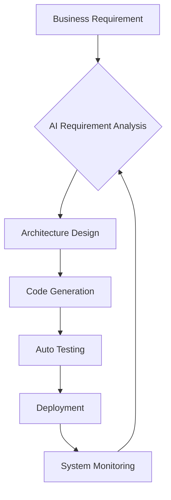

The future of **AI Engineering** promises to fundamentally transform how we build, deploy, and maintain software. We are entering an era where AI agents will not just assist developers but actively participate in the software lifecycle with increasing autonomy.

<!-- truncate -->

## The Evolution of Developer Roles

As AI becomes more integrated into development workflows, the **role of the developer is shifting** from manual coding to system architecture and AI orchestration.

| Traditional Developer 🧑‍💻 | Future AI Engineer 🤖 |
| :--- | :--- |
| **Primary Task** | Writing code line-by-line | Designing AI-driven systems |
| **Focus** | Implementation details | Requirements and quality assurance |
| **Tools** | Compilers, Debuggers | AI Agents, Prompt Engineering |
| **Output** | Source Code | Specifications and AI workflows |

:::info Key Insight
The future developer will be a **"Conductor of Intelligence"** - orchestrating multiple AI systems to create complex, autonomous software solutions.
:::

## Autonomous Development Systems

The next frontier in AI Engineering is **fully autonomous development**. AI agents will be capable of:

1.  **Understanding Requirements:** Interpreting high-level business goals and constraints
2.  **Designing Architecture:** Creating system designs and selecting appropriate technologies
3.  **Implementing Features:** Writing, testing, and debugging code autonomously
4.  **Deploying Solutions:** Managing infrastructure and deployment processes
5.  **Maintaining Systems:** Monitoring, updating, and optimizing in production

### The Autonomous Development Cycle



## The Rise of Spec-Driven AI Engineering

**Spec-Driven Development** will become the cornerstone of AI Engineering. The process involves:

- **Precise Specifications:** Writing detailed, unambiguous specifications that AI agents can understand and execute
- **Automated Verification:** Using AI to validate that implementations match specifications
- **Iterative Refinement:** Continuously improving both specs and AI outputs based on feedback

This approach will enable teams to build robust systems at unprecedented speed.

## Collaborative Intelligence

### Human-AI Symbiosis

The future will not be about replacing humans with AI, but about **creating powerful human-AI partnerships**:

- **Humans contribute:** Creative vision, ethical judgment, business context, and strategic decision-making
- **AI contributes:** Rapid implementation, pattern recognition, optimization, and continuous operation

### Multi-Agent Systems

Complex software will increasingly be built using **networks of specialized AI agents**:

- **Research Agents:** Gather and synthesize information
- **Design Agents:** Create system architectures
- **Code Agents:** Write and test implementations
- **Security Agents:** Monitor and enforce security policies
- **Optimization Agents:** Continuously improve performance

## Infrastructure Evolution

### Infrastructure as Intention

Instead of writing Infrastructure as Code (IaC), developers will specify **intentions and desired outcomes**:

```yaml
# Instead of detailed Terraform code
# Developers describe what they want:
service:
  availability: 99.99%
  scale: elastic
  security: enterprise-grade
  cost: optimized
```

AI systems will then determine the optimal infrastructure configuration to fulfill these intentions.

### Self-Healing Systems

Future applications will be self-aware and self-correcting:

- **Auto-detection:** Automatically identify performance issues, security vulnerabilities, and bugs
- **Auto-correction:** Implement fixes without human intervention
- **Auto-optimization:** Continuously tune performance and costs based on usage patterns

## The Challenge of Governance

### Ethics by Design

As AI systems become more autonomous, **embedding ethical considerations** into the development process becomes critical:

- **Fairness:** Ensuring AI systems don't perpetuate bias
- **Transparency:** Making AI decision-making processes understandable
- **Accountability:** Maintaining human oversight and responsibility
- **Privacy:** Protecting user data and consent

### Continuous Compliance

AI systems will be responsible for **maintaining compliance** with evolving regulations:

- Automatically updating to meet new legal requirements
- Ensuring data handling follows regional laws
- Maintaining audit trails of all decisions

## Looking Ahead

The transformation to AI-driven software development is already underway. In the next decade, we can expect:

- **AI-assisted development** to become the standard across all organizations
- **Full autonomation of routine development tasks** to be common practice
- **New engineering roles** focused on AI orchestration and specification
- **Dramatically faster development cycles** for complex systems
- **More accessible software creation** for non-technical domain experts

---