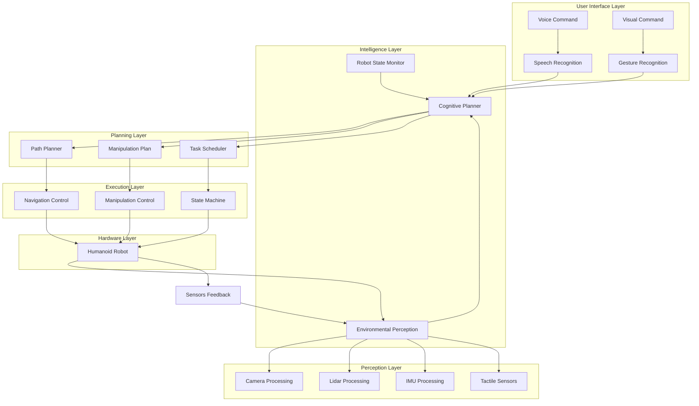

import ChapterControls from '@site/src/components/ChapterControls';
import PersonalizeContentButton from '@site/src/components/PersonalizeContentButton';
import TranslateContentButton from '@site/src/components/TranslateContentButton';

# Chapter 6: The Autonomous Humanoid Capstone Project


<PersonalizeContentButton chapterId="chapter-6" />
<TranslateContentButton chapterId="chapter-6" />

## Overview

The Autonomous Humanoid Capstone Project represents the culmination of all concepts explored throughout this course: from the foundational ROS 2 middleware to advanced NVIDIA Isaac perception, and from Vision-Language-Action integration to full autonomous operation. This chapter guides you through the complete implementation of an autonomous humanoid robot system capable of receiving voice commands, planning paths, navigating obstacles, identifying objects using computer vision, and manipulating them. This capstone project integrates all the technological components covered in previous chapters into a cohesive, functioning autonomous system.

## Learning Objectives

By the end of this chapter, you will:

- Integrate all previous course components into a complete autonomous humanoid system
- Implement end-to-end voice-to-action pipeline for humanoid robots
- Design and implement a complete mission planning and execution system
- Deploy perception, navigation, and manipulation capabilities simultaneously
- Test and validate the integrated autonomous system
- Understand challenges and solutions in full-system integration
- Develop debugging and optimization strategies for complex robotic systems

## Capstone Architecture Overview

### Complete System Architecture



### System Integration Challenges

The capstone project addresses several complex integration challenges:

1. **Temporal Synchronization**: Coordinating perception, planning, and action at appropriate frequencies
2. **Resource Management**: Efficiently allocating computational resources across subsystems
3. **State Consistency**: Maintaining consistent robot state across distributed components
4. **Failure Recovery**: Handling failures gracefully while maintaining system operation
5. **Safety Assurance**: Ensuring safe operation in dynamic human environments

## Voice Command to Action Pipeline

### Complete Voice Processing System

```python
# voice_pipeline.py
import openai
import speech_recognition as sr
import threading
import queue
from dataclasses import dataclass
from typing import Dict, List, Optional
import time

@dataclass
class VoiceCommand:
    """Represents a processed voice command"""
    text: str
    confidence: float
    timestamp: float
    intent: str
    objects: List[str]
    location: Optional[str]

class VoiceCommandProcessor:
    def __init__(self, api_key: str):
        openai.api_key = api_key
        self.recognizer = sr.Recognizer()
        self.microphone = sr.Microphone()
        self.command_queue = queue.Queue()
        self.is_listening = False
        self.listening_thread = None
        
        # Initialize with environmental noise consideration
        self.recognizer.energy_threshold = 300
        self.recognizer.dynamic_energy_threshold = True
        self.recognizer.pause_threshold = 0.8  # Adjust for natural speech

    def start_listening(self):
        """Start the voice command listening loop"""
        self.is_listening = True
        self.listening_thread = threading.Thread(target=self._listen_loop)
        self.listening_thread.daemon = True
        self.listening_thread.start()
        print("Voice command processor started")

    def stop_listening(self):
        """Stop the voice command listening loop"""
        self.is_listening = False
        if self.listening_thread:
            self.listening_thread.join()
        print("Voice command processor stopped")

    def _listen_loop(self):
        """Continuous listening loop with error handling"""
        with self.microphone as source:
            self.recognizer.adjust_for_ambient_noise(source, duration=1.0)
            print("Listening for commands... (Say 'stop' to quit)")

            while self.is_listening:
                try:
                    # Listen with timeout
                    audio = self.recognizer.listen(source, timeout=5.0, phrase_time_limit=10.0)
                    
                    # Transcribe using Whisper
                    transcript = self._transcribe_audio(audio)
                    
                    if transcript:
                        # Process transcript for intent and entities
                        command = self._process_transcript(transcript)
                        
                        # Add to processing queue
                        self.command_queue.put(command)
                        
                        print(f"Command recognized: {transcript} (Confidence: {command.confidence:.2f})")

                except sr.WaitTimeoutError:
                    # Continue listening if no speech detected
                    continue
                except sr.RequestError:
                    print("API unavailable - check connection and API key")
                except sr.UnknownValueError:
                    # Could not understand audio
                    print("Could not understand audio")
                except Exception as e:
                    print(f"Error in voice processing: {e}")

    def _transcribe_audio(self, audio) -> Optional[str]:
        """Transcribe audio using OpenAI Whisper"""
        try:
            # Save audio for Whisper API
            audio_data = audio.get_raw_data()
            with open("temp_audio.webm", "wb") as f:
                f.write(audio.get_wav_data())  # Convert to WAV format

            # Transcribe with Whisper API
            with open("temp_audio.webm", "rb") as audio_file:
                result = openai.Audio.transcribe(
                    model="whisper-1",
                    file=audio_file,
                    response_format="text"
                )
            
            return result.strip()
        except Exception as e:
            print(f"Error transcribing audio: {e}")
            return None

    def _process_transcript(self, transcript: str) -> VoiceCommand:
        """Process transcript to extract intent and entities"""
        # Analyze intent
        intent = self._classify_intent(transcript)
        
        # Extract objects
        objects = self._extract_objects(transcript)
        
        # Extract location
        location = self._extract_location(transcript)
        
        return VoiceCommand(
            text=transcript,
            confidence=0.9,  # Placeholder confidence
            timestamp=time.time(),
            intent=intent,
            objects=objects,
            location=location
        )

    def _classify_intent(self, text: str) -> str:
        """Classify the intent of the voice command"""
        text_lower = text.lower()
        
        intent_keywords = {
            'navigation': ['go to', 'navigate', 'move to', 'walk to', 'travel to'],
            'manipulation': ['pick up', 'grasp', 'take', 'get', 'bring', 'place', 'put'],
            'cleaning': ['clean', 'tidy', 'organize', 'clear'],
            'search': ['find', 'locate', 'look for', 'where is'],
            'assist': ['help', 'assist', 'can you', 'could you'],
            'stop': ['stop', 'halt', 'cease', 'quit']
        }
        
        for intent, keywords in intent_keywords.items():
            if any(keyword in text_lower for keyword in keywords):
                return intent
        
        return 'unknown'

    def _extract_objects(self, text: str) -> List[str]:
        """Extract object references from text"""
        # Common household objects that the robot should recognize
        object_keywords = [
            'cup', 'bottle', 'glass', 'plate', 'bowl', 'fork', 'spoon', 'knife',
            'book', 'pen', 'pencil', 'paper', 'notebook', 'phone', 'tablet',
            'chair', 'table', 'sofa', 'bed', 'desk', 'cabinet', 'drawer',
            'ball', 'toy', 'box', 'bag', 'laptop', 'remote', 'keys', 'wallet'
        ]
        
        found_objects = []
        text_lower = text.lower()
        
        for obj in object_keywords:
            if obj in text_lower:
                found_objects.append(obj)
        
        return found_objects

    def _extract_location(self, text: str) -> Optional[str]:
        """Extract location references from text"""
        location_keywords = [
            'kitchen', 'living room', 'bedroom', 'bathroom', 'office', 
            'dining room', 'hallway', 'garage', 'garden', 'outside',
            'table', 'counter', 'desk', 'shelf', 'cabinet', 'bed', 'sofa'
        ]
        
        text_lower = text.lower()
        for location in location_keywords:
            if location in text_lower:
                return location
        
        return None

# Example usage in capstone system
class CapstoneVoiceSystem:
    def __init__(self, api_key: str):
        self.processor = VoiceCommandProcessor(api_key)
        self.active_commands = []
        
    def start_system(self):
        """Start the voice command system"""
        self.processor.start_listening()
        
    def get_next_command(self) -> Optional[VoiceCommand]:
        """Get the next available command"""
        try:
            return self.processor.command_queue.get_nowait()
        except queue.Empty:
            return None
    
    def stop_system(self):
        """Stop the voice command system"""
        self.processor.stop_listening()
```

### Intent-Based Command Processing

```python
# intent_processor.py
from enum import Enum
from dataclasses import dataclass
from typing import Dict, List, Optional
import re

class TaskPriority(Enum):
    HIGH = 3
    MEDIUM = 2
    LOW = 1

@dataclass
class Task:
    """Represents an executable task"""
    id: str
    type: str
    description: str
    parameters: Dict
    priority: TaskPriority
    dependencies: List[str] = None

class IntentProcessor:
    def __init__(self):
        self.task_counter = 0
        self.current_tasks = []
    
    def process_command(self, command: VoiceCommand) -> List[Task]:
        """Process voice command and generate executable tasks"""
        intent = command.intent
        objects = command.objects
        location = command.location
        
        if intent == 'navigation':
            return self._process_navigation_command(command)
        elif intent == 'manipulation':
            return self._process_manipulation_command(command)
        elif intent == 'cleaning':
            return self._process_cleaning_command(command)
        elif intent == 'search':
            return self._process_search_command(command)
        else:
            # For unknown commands, try to parse based on content
            return self._infer_command(command)
    
    def _process_navigation_command(self, command: VoiceCommand) -> List[Task]:
        """Process navigation-related commands"""
        tasks = []
        
        # Example: "Go to the kitchen"
        if command.location:
            tasks.append(self._create_task(
                'navigation',
                f'Navigate to {command.location}',
                {'target_location': command.location},
                TaskPriority.MEDIUM
            ))
        else:
            # Try to infer destination from objects
            for obj in command.objects:
                tasks.append(self._create_task(
                    'search_and_navigate',
                    f'Find and navigate to {obj}',
                    {'target_object': obj},
                    TaskPriority.MEDIUM
                ))
        
        return tasks
    
    def _process_manipulation_command(self, command: VoiceCommand) -> List[Task]:
        """Process manipulation-related commands"""
        tasks = []
        
        for obj in command.objects:
            # Approach object
            tasks.append(self._create_task(
                'approach_object',
                f'Approach {obj}',
                {'target_object': obj},
                TaskPriority.HIGH
            ))
            
            # Grasp object
            tasks.append(self._create_task(
                'grasp_object',
                f'Grasp {obj}',
                {'target_object': obj},
                TaskPriority.HIGH
            ))
        
        # If there's a destination (e.g., "put the cup on the table")
        location = self._extract_destination(command.text)
        if location:
            for obj in command.objects:
                tasks.append(self._create_task(
                    'navigate_to_place',
                    f'Navigate to {location} and place {obj}',
                    {'target_location': location, 'object': obj},
                    TaskPriority.MEDIUM
                ))
        
        return tasks
    
    def _process_cleaning_command(self, command: VoiceCommand) -> List[Task]:
        """Process cleaning-related commands"""
        tasks = []
        
        # Scan area for cleaning targets
        tasks.append(self._create_task(
            'scan_cleaning_area',
            'Scan area for cleaning targets',
            {'scan_radius': 3.0, 'area': command.location},
            TaskPriority.MEDIUM
        ))
        
        # Plan cleaning path
        tasks.append(self._create_task(
            'plan_cleaning_path',
            'Plan systematic cleaning path',
            {'coverage_type': 'grid', 'area': command.location},
            TaskPriority.MEDIUM
        ))
        
        # Execute cleaning
        tasks.append(self._create_task(
            'execute_cleaning',
            'Execute planned cleaning path',
            {'area': command.location},
            TaskPriority.LOW
        ))
        
        return tasks
    
    def _process_search_command(self, command: VoiceCommand) -> List[Task]:
        """Process search-related commands"""
        tasks = []
        
        for obj in command.objects:
            # Navigate and search for object
            tasks.append(self._create_task(
                'search_for_object',
                f'Search for {obj}',
                {'target_object': obj, 'search_area': command.location},
                TaskPriority.HIGH
            ))
        
        return tasks
    
    def _infer_command(self, command: VoiceCommand) -> List[Task]:
        """Infer command type when intent is unknown"""
        # Look for patterns in the text
        text_lower = command.text.lower()
        
        if any(word in text_lower for word in ['help', 'can you', 'could you']):
            # Likely an assistive command
            return self._process_assistive_command(command)
        
        # Default to search if objects mentioned
        if command.objects:
            return self._process_search_command(command)
        
        # Default to navigation if location mentioned
        if command.location:
            return self._process_navigation_command(command)
        
        # Unknown command
        return []
    
    def _process_assistive_command(self, command: VoiceCommand) -> List[Task]:
        """Process assistive commands"""
        # For now, assume assistive commands involve manipulation
        return self._process_manipulation_command(command)
    
    def _extract_destination(self, text: str) -> Optional[str]:
        """Extract destination from phrases like 'put X on Y'"""
        # Pattern: put/place X on/in/at Y
        patterns = [
            r'put\s+.*?\s+on\s+(\w+)',
            r'place\s+.*?\s+on\s+(\w+)',
            r'put\s+.*?\s+in\s+(\w+)',
            r'place\s+.*?\s+in\s+(\w+)',
            r'to\s+(\w+)',  # "take this to kitchen"
        ]
        
        text_lower = text.lower()
        for pattern in patterns:
            match = re.search(pattern, text_lower)
            if match:
                destination = match.group(1)
                # Verify it's a location (not an object)
                if destination in ['table', 'kitchen', 'bedroom', 'living room', 'desk', 'cabinet']:
                    return destination
        
        return None
    
    def _create_task(self, task_type: str, description: str, 
                     parameters: Dict, priority: TaskPriority) -> Task:
        """Create a new task with unique ID"""
        self.task_counter += 1
        task_id = f"task_{self.task_counter:04d}"
        
        return Task(
            id=task_id,
            type=task_type,
            description=description,
            parameters=parameters,
            priority=priority
        )
```

## Environmental Perception System

### Multi-Sensor Perception Integration

```python
# perception_system.py
import cv2
import numpy as np
import rclpy
from rclpy.node import Node
from sensor_msgs.msg import Image, LaserScan, Imu, PointCloud2
from std_msgs.msg import String
from geometry_msgs.msg import PointStamped
from visualization_msgs.msg import MarkerArray
from cv_bridge import CvBridge
from message_filters import ApproximateTimeSynchronizer, Subscriber
import tf2_ros
import open3d as o3d

class MultiSensorPerceptionSystem(Node):
    def __init__(self):
        super().__init__('multi_sensor_perception')
        
        # Initialize CV bridge
        self.cv_bridge = CvBridge()
        
        # Create subscribers for all sensors
        self.rgb_sub = self.create_subscription(
            Image, '/camera/color/image_raw', self.rgb_callback, 10
        )
        self.depth_sub = self.create_subscription(
            Image, '/camera/depth/image_raw', self.depth_callback, 10
        )
        self.lidar_sub = self.create_subscription(
            LaserScan, '/scan', self.lidar_callback, 10
        )
        self.imu_sub = self.create_subscription(
            Imu, '/imu/data', self.imu_callback, 10
        )
        
        # Publishers
        self.object_pub = self.create_publisher(
            String, '/detected_objects', 10
        )
        self.map_pub = self.create_publisher(
            PointCloud2, '/environment_map', 10
        )
        self.tf_buffer = tf2_ros.Buffer()
        self.tf_listener = tf2_ros.TransformListener(self.tf_buffer, self)
        
        # Internal state
        self.current_rgb = None
        self.current_depth = None
        self.current_lidar = None
        self.current_imu = None
        self.object_detector = self._initialize_object_detector()
        self.spatial_mapper = SpatialMapper()
        
        # Processing timer
        self.process_timer = self.create_timer(0.1, self.process_sensors)
        
        self.get_logger().info('Multi-sensor perception system initialized')

    def _initialize_object_detector(self):
        """Initialize object detection system"""
        # This would initialize a YOLO, DETR, or similar detector
        # For now, using placeholder
        class PlaceholderDetector:
            def detect(self, image):
                # Return mock detections
                h, w = image.shape[:2]
                return [
                    {'class': 'bottle', 'bbox': [w//2-25, h//2-50, w//2+25, h//2+50], 'confidence': 0.9}
                ]
        return PlaceholderDetector()

    def rgb_callback(self, msg):
        """Process RGB camera data"""
        try:
            self.current_rgb = self.cv_bridge.imgmsg_to_cv2(msg, "bgr8")
        except Exception as e:
            self.get_logger().error(f'Error processing RGB: {e}')

    def depth_callback(self, msg):
        """Process depth camera data"""
        try:
            self.current_depth = self.cv_bridge.imgmsg_to_cv2(msg, "32FC1")
        except Exception as e:
            self.get_logger().error(f'Error processing depth: {e}')

    def lidar_callback(self, msg):
        """Process LiDAR data"""
        self.current_lidar = msg

    def imu_callback(self, msg):
        """Process IMU data"""
        self.current_imu = msg

    def process_sensors(self):
        """Process all sensor data and create unified perception"""
        if self.current_rgb is not None and self.current_depth is not None:
            # Perform object detection
            detections = self.object_detector.detect(self.current_rgb)
            
            # Create 3D positions for detected objects
            detected_objects = []
            for detection in detections:
                obj_3d_pos = self._convert_2d_to_3d(
                    detection['bbox'], 
                    self.current_depth
                )
                
                detected_objects.append({
                    'class': detection['class'],
                    'position': obj_3d_pos,
                    'bbox': detection['bbox'],
                    'confidence': detection['confidence']
                })
            
            # Publish detected objects
            self._publish_detected_objects(detected_objects)
            
            # Update spatial map
            self.spatial_mapper.update_with_detections(
                detected_objects, 
                self.current_rgb, 
                self.current_depth
            )
            
            # Publish updated map
            self._publish_environment_map()

    def _convert_2d_to_3d(self, bbox, depth_image):
        """Convert 2D bounding box to 3D position using depth"""
        x1, y1, x2, y2 = bbox
        center_x = (x1 + x2) // 2
        center_y = (y1 + y2) // 2
        
        # Get depth at center point
        depth = depth_image[center_y, center_x]
        
        # Convert to 3D coordinates (simplified)
        # This would require proper camera calibration in reality
        x_3d = (center_x - 320) * depth / 600  # Placeholder focal length
        y_3d = (center_y - 240) * depth / 600
        z_3d = depth
        
        return [x_3d, y_3d, z_3d]

    def _publish_detected_objects(self, objects):
        """Publish detected objects"""
        obj_string = String()
        obj_string.data = str([obj['class'] for obj in objects])
        self.object_pub.publish(obj_string)

    def _publish_environment_map(self):
        """Publish environment map"""
        # This would publish a real PointCloud2 message
        pass

class SpatialMapper:
    """Maintains spatial understanding of the environment"""
    def __init__(self):
        self.map_points = []
        self.objects = {}
        self.visited_regions = set()
        
    def update_with_detections(self, detections, rgb_image, depth_image):
        """Update spatial map with new detections"""
        for detection in detections:
            obj_id = detection['class'] + str(len(self.map_points))
            
            # Update object tracking
            if obj_id in self.objects:
                # Update existing object position with temporal filtering
                old_pos = self.objects[obj_id]['position']
                new_pos = detection['position']
                filtered_pos = self._temporal_filter(old_pos, new_pos)
                self.objects[obj_id]['position'] = filtered_pos
            else:
                # Add new object
                self.objects[obj_id] = detection
        
        # Update spatial map with new points
        self._update_point_cloud(detections)
    
    def _temporal_filter(self, old_pos, new_pos, alpha=0.7):
        """Simple temporal filtering for object positions"""
        return [alpha * old_val + (1 - alpha) * new_val 
                for old_val, new_val in zip(old_pos, new_pos)]
    
    def _update_point_cloud(self, detections):
        """Update the spatial point cloud with new information"""
        # This would add points to a maintained 3D map
        pass
    
    def get_nearest_object(self, obj_class, reference_point):
        """Get nearest object of specified class to reference point"""
        min_dist = float('inf')
        nearest_obj = None
        
        for obj_id, obj_data in self.objects.items():
            if obj_data['class'] == obj_class:
                dist = self._euclidean_distance(
                    obj_data['position'], 
                    reference_point
                )
                if dist < min_dist:
                    min_dist = dist
                    nearest_obj = obj_data
        
        return nearest_obj
    
    def _euclidean_distance(self, point1, point2):
        """Calculate Euclidean distance between two 3D points"""
        return np.sqrt(sum((p1 - p2) ** 2 for p1, p2 in zip(point1, point2)))
```

## Path Planning and Navigation System

### Advanced Navigation for Humanoids

```python
# navigation_system.py
import numpy as np
import heapq
from typing import List, Tuple, Dict, Optional
from dataclasses import dataclass

@dataclass
class Node:
    """Node for path planning"""
    x: float
    y: float
    z: float  # For 3D navigation
    cost: float
    heuristic: float
    parent: Optional['Node'] = None
    
    def __lt__(self, other):
        return (self.cost + self.heuristic) < (other.cost + other.heuristic)

class HumanoidPathPlanner:
    def __init__(self):
        self.map_resolution = 0.1  # meters per cell
        self.step_height_limit = 0.15  # maximum step height for humanoid
        self.step_width_limit = 0.4   # maximum step width
        self.balance_margin = 0.1     # safety margin for balance
        self.collision_threshold = 0.3 # minimum distance from obstacles
        
    def plan_path(self, start: Tuple[float, float, float], 
                  goal: Tuple[float, float, float], 
                  occupancy_grid: np.ndarray) -> Optional[List[Tuple[float, float, float]]]:
        """Plan path for humanoid considering physical constraints"""
        
        # Convert continuous coordinates to grid coordinates
        start_grid = self._world_to_grid(start)
        goal_grid = self._world_to_grid(goal)
        
        # Check if start and goal are valid
        if not self._is_valid_position(start_grid, occupancy_grid):
            return None
        if not self._is_valid_position(goal_grid, occupancy_grid):
            return None
        
        # Run A* pathfinding with humanoid constraints
        path = self._a_star_search(start_grid, goal_grid, occupancy_grid)
        
        if path is None:
            return None
        
        # Convert back to world coordinates
        world_path = [self._grid_to_world(pos) for pos in path]
        
        # Smooth the path considering humanoid dynamics
        smoothed_path = self._smooth_path(world_path, occupancy_grid)
        
        return smoothed_path
    
    def _a_star_search(self, start: Tuple[int, int, int], 
                       goal: Tuple[int, int, int], 
                       occupancy_grid: np.ndarray) -> Optional[List[Tuple[int, int, int]]]:
        """A* pathfinding algorithm with humanoid constraints"""
        
        open_set = []
        heapq.heappush(open_set, Node(start[0], start[1], start[2], 0, 0))
        
        closed_set = set()
        g_costs = {start: 0}
        
        while open_set:
            current = heapq.heappop(open_set)
            
            # Convert back to tuple for hashing
            current_pos = (current.x, current.y, current.z)
            
            if current_pos == goal:
                # Reconstruct path
                path = []
                node = current
                while node:
                    path.append((int(node.x), int(node.y), int(node.z)))
                    node = node.parent
                return path[::-1]
            
            if current_pos in closed_set:
                continue
            
            closed_set.add(current_pos)
            
            # Generate neighbors (considering humanoid step constraints)
            neighbors = self._get_valid_neighbors(current_pos, occupancy_grid)
            
            for neighbor_pos in neighbors:
                neighbor_x, neighbor_y, neighbor_z = neighbor_pos
                
                # Calculate movement cost
                movement_cost = self._calculate_movement_cost(
                    current_pos, neighbor_pos, occupancy_grid
                )
                
                tentative_g_cost = g_costs[current_pos] + movement_cost
                
                if neighbor_pos in g_costs and tentative_g_cost >= g_costs[neighbor_pos]:
                    continue
                
                g_costs[neighbor_pos] = tentative_g_cost
                heuristic = self._calculate_heuristic(neighbor_pos, goal)
                
                neighbor_node = Node(
                    neighbor_x, neighbor_y, neighbor_z,
                    tentative_g_cost, heuristic,
                    current
                )
                
                heapq.heappush(open_set, neighbor_node)
        
        return None  # No path found
    
    def _get_valid_neighbors(self, position: Tuple[int, int, int], 
                            occupancy_grid: np.ndarray) -> List[Tuple[int, int, int]]:
        """Get valid neighboring positions for humanoid"""
        x, y, z = position
        neighbors = []
        
        # Define possible movement directions (considering humanoid constraints)
        # We'll use 3D movements for full navigation
        possible_moves = [
            # Horizontal moves (4-connected)
            (1, 0, 0), (-1, 0, 0), (0, 1, 0), (0, -1, 0),
            # Diagonal moves (4-connected)
            (1, 1, 0), (1, -1, 0), (-1, 1, 0), (-1, -1, 0),
            # Vertical moves (for stairs/steps)
            (0, 0, 1), (0, 0, -1),
            # Combinations for complex terrain
            (1, 0, 1), (-1, 0, 1), (0, 1, 1), (0, -1, 1),
            (1, 0, -1), (-1, 0, -1), (0, 1, -1), (0, -1, -1),
        ]
        
        for dx, dy, dz in possible_moves:
            nx, ny, nz = x + dx, y + dy, z + dz
            
            # Check bounds
            if (0 <= nx < occupancy_grid.shape[0] and 
                0 <= ny < occupancy_grid.shape[1] and 
                0 <= nz < occupancy_grid.shape[2] and 
                self._is_valid_position((nx, ny, nz), occupancy_grid)):
                
                # Check humanoid-specific constraints
                if self._is_valid_humanoid_move((x, y, z), (nx, ny, nz)):
                    neighbors.append((nx, ny, nz))
        
        return neighbors
    
    def _is_valid_position(self, pos: Tuple[int, int, int], 
                          occupancy_grid: np.ndarray) -> bool:
        """Check if a position is valid (not occupied)"""
        x, y, z = pos
        
        if (0 <= x < occupancy_grid.shape[0] and 
            0 <= y < occupancy_grid.shape[1] and 
            0 <= z < occupancy_grid.shape[2]):
            
            return occupancy_grid[x, y, z] == 0  # 0 = free space, 1 = obstacle
        return False
    
    def _is_valid_humanoid_move(self, from_pos: Tuple[float, float, float], 
                               to_pos: Tuple[float, float, float]) -> bool:
        """Check if move is valid for humanoid based on physical constraints"""
        from_x, from_y, from_z = from_pos
        to_x, to_y, to_z = to_pos
        
        # Calculate step dimensions
        step_width = np.sqrt((to_x - from_x)**2 + (to_y - from_y)**2)
        step_height = abs(to_z - from_z)
        
        # Check against humanoid constraints
        if step_width > self.step_width_limit:
            return False
        if step_height > self.step_height_limit:
            return False
        
        return True
    
    def _calculate_movement_cost(self, from_pos: Tuple[int, int, int], 
                                to_pos: Tuple[int, int, int], 
                                occupancy_grid: np.ndarray) -> float:
        """Calculate movement cost based on terrain and obstacles"""
        # Base cost is distance
        dx = to_pos[0] - from_pos[0]
        dy = to_pos[1] - from_pos[1]
        dz = to_pos[2] - from_pos[2]
        
        distance_cost = np.sqrt(dx*dx + dy*dy + dz*dz)
        
        # Add penalty for proximity to obstacles
        obstacle_penalty = self._calculate_obstacle_penalty(to_pos, occupancy_grid)
        
        return distance_cost + obstacle_penalty
    
    def _calculate_obstacle_penalty(self, pos: Tuple[int, int, int], 
                                   occupancy_grid: np.ndarray) -> float:
        """Calculate penalty based on proximity to obstacles"""
        penalty = 0.0
        
        # Check surrounding cells for obstacles
        for dx in [-1, 0, 1]:
            for dy in [-1, 0, 1]:
                for dz in [-1, 0, 1]:
                    if dx == 0 and dy == 0 and dz == 0:
                        continue
                    
                    nx, ny, nz = pos[0] + dx, pos[1] + dy, pos[2] + dz
                    
                    if (0 <= nx < occupancy_grid.shape[0] and 
                        0 <= ny < occupancy_grid.shape[1] and 
                        0 <= nz < occupancy_grid.shape[2]):
                        
                        if occupancy_grid[nx, ny, nz] > 0:  # Obstacle
                            distance = np.sqrt(dx*dx + dy*dy + dz*dz)
                            penalty += 1.0 / (distance + 0.1)  # Closer obstacles = higher penalty
        
        return penalty
    
    def _calculate_heuristic(self, pos: Tuple[int, int, int], 
                            goal: Tuple[int, int, int]) -> float:
        """Calculate heuristic (estimated cost to goal)"""
        dx = goal[0] - pos[0]
        dy = goal[1] - pos[1]
        dz = goal[2] - pos[2]
        
        return np.sqrt(dx*dx + dy*dy + dz*dz)
    
    def _smooth_path(self, path: List[Tuple[float, float, float]], 
                     occupancy_grid: np.ndarray) -> List[Tuple[float, float, float]]:
        """Smooth path considering humanoid dynamics"""
        if len(path) < 3:
            return path
        
        smoothed_path = [path[0]]
        
        i = 0
        while i < len(path) - 1:
            j = i + 1
            # Try to connect further points if possible
            while j < len(path) - 1:
                if self._is_direct_path_valid(path[i], path[j], occupancy_grid):
                    j += 1
                else:
                    break
            
            # Add the last valid point
            smoothed_path.append(path[j-1])
            i = j - 1
        
        return smoothed_path
    
    def _is_direct_path_valid(self, start: Tuple[float, float, float], 
                             end: Tuple[float, float, float], 
                             occupancy_grid: np.ndarray) -> bool:
        """Check if direct path between two points is collision-free"""
        # Sample points along the line and check for collisions
        num_samples = max(int(np.linalg.norm(np.array(end) - np.array(start)) / self.map_resolution), 10)
        
        for i in range(num_samples + 1):
            t = i / num_samples
            sample_pos = tuple(
                start[j] + t * (end[j] - start[j]) for j in range(3)
            )
            
            grid_pos = self._world_to_grid(sample_pos)
            if (not self._is_valid_position(grid_pos, occupancy_grid) or 
                not self._is_valid_humanoid_move(start, sample_pos)):
                return False
        
        return True
    
    def _world_to_grid(self, world_pos: Tuple[float, float, float]) -> Tuple[int, int, int]:
        """Convert world coordinates to grid coordinates"""
        x, y, z = world_pos
        return (int(x / self.map_resolution), 
                int(y / self.map_resolution), 
                int(z / self.map_resolution))
    
    def _grid_to_world(self, grid_pos: Tuple[int, int, int]) -> Tuple[float, float, float]:
        """Convert grid coordinates to world coordinates"""
        x, y, z = grid_pos
        return (x * self.map_resolution, 
                y * self.map_resolution, 
                z * self.map_resolution)

class NavigationController:
    """Controls the humanoid's movement along planned paths"""
    def __init__(self):
        self.path = []
        self.current_waypoint_idx = 0
        self.arrival_threshold = 0.3  # meters
        self.balance_controller = BalanceController()
        
    def set_path(self, path: List[Tuple[float, float, float]]):
        """Set new path for navigation"""
        self.path = path
        self.current_waypoint_idx = 0
        print(f"Set path with {len(path)} waypoints")
    
    def update_navigation(self, current_pose: Tuple[float, float, float, float, float, float, float]):
        """Update navigation based on current pose (x, y, z, qx, qy, qz, qw)"""
        if not self.path or self.current_waypoint_idx >= len(self.path):
            return None  # No path to follow or completed
        
        # Get current position
        current_pos = current_pose[:3]  # x, y, z
        target_pos = self.path[self.current_waypoint_idx]
        
        # Check if we've reached current waypoint
        distance = np.linalg.norm(np.array(current_pos) - np.array(target_pos))
        
        if distance < self.arrival_threshold:
            # Move to next waypoint
            self.current_waypoint_idx += 1
            if self.current_waypoint_idx >= len(self.path):
                print("Navigation completed!")
                return "NAVIGATION_COMPLETED"
        
        if self.current_waypoint_idx < len(self.path):
            next_target = self.path[self.current_waypoint_idx]
            return self._calculate_navigation_command(current_pos, next_target)
        
        return None
    
    def _calculate_navigation_command(self, current_pos: Tuple[float, float, float], 
                                    target_pos: Tuple[float, float, float]):
        """Calculate navigation command to reach target"""
        # Calculate desired direction
        direction = np.array(target_pos) - np.array(current_pos)
        distance = np.linalg.norm(direction)
        
        # Normalize direction
        if distance > 0:
            direction = direction / distance
        
        # Create navigation command
        cmd_vel = {
            'linear_x': min(direction[0] * 0.3, 0.3),  # Limit speed
            'linear_y': min(direction[1] * 0.3, 0.3),
            'linear_z': min(direction[2] * 0.1, 0.1),  # Vertical motion limited
            'angular_z': 0.0  # For now, assume perfect orientation
        }
        
        # Apply balance corrections
        cmd_vel = self.balance_controller.apply_balance_corrections(cmd_vel)
        
        return cmd_vel

class BalanceController:
    """Maintains balance during humanoid navigation"""
    def __init__(self):
        self.com_height = 0.8  # Center of mass height
        self.balance_margin = 0.1  # Safety margin
        
    def apply_balance_corrections(self, cmd_vel: Dict):
        """Apply balance corrections to navigation commands"""
        # This would integrate with actual balance control system
        # For now, return commands with potential modifications
        return cmd_vel
```

## Manipulation System for Humanoids

### Grasp Planning and Execution

```python
# manipulation_system.py
import numpy as np
from typing import List, Tuple, Dict, Optional
from dataclasses import dataclass

@dataclass
class GraspConfiguration:
    """Represents a grasp configuration"""
    position: Tuple[float, float, float]
    orientation: Tuple[float, float, float, float]  # quaternion (x, y, z, w)
    joint_angles: List[float]
    grasp_type: str  # 'power', 'precision', etc.
    approach_direction: Tuple[float, float, float]

class GraspPlanner:
    """Plans grasps for humanoid robot hands"""
    def __init__(self):
        self.hand_dof = 15  # Example: 5 fingers × 3 joints each
        self.grasp_database = self._load_grasp_database()
        
    def _load_grasp_database(self) -> Dict[str, List[GraspConfiguration]]:
        """Load pre-computed grasp configurations for common objects"""
        # In reality, this would be loaded from a database or computed
        return {
            'bottle': [
                GraspConfiguration(
                    position=(0, 0, 0.15),  # 15cm up from base
                    orientation=(0, 0, 0, 1),  # upright
                    joint_angles=[0.0] * self.hand_dof,
                    grasp_type='cylindrical',
                    approach_direction=(0, 0, 1)  # from above
                )
            ],
            'cup': [
                GraspConfiguration(
                    position=(0, 0, 0.08),  # 8cm up from base
                    orientation=(0, 0, 0, 1),
                    joint_angles=[0.0] * self.hand_dof,
                    grasp_type='cylindrical',
                    approach_direction=(0, 0, 1)
                )
            ],
            'book': [
                GraspConfiguration(
                    position=(0, 0, 0.01),  # near the center
                    orientation=(0, 1, 0, 0),  # rotated 180° around Y
                    joint_angles=[0.0] * self.hand_dof,
                    grasp_type='edge',
                    approach_direction=(1, 0, 0)  # from the side
                )
            ]
        }
    
    def plan_grasp(self, object_info: Dict) -> Optional[GraspConfiguration]:
        """Plan grasp for a detected object"""
        obj_class = object_info.get('class', 'unknown')
        obj_position = object_info.get('position', (0, 0, 0))
        obj_dimensions = object_info.get('dimensions', (0.1, 0.1, 0.1))
        
        if obj_class in self.grasp_database:
            # Get the first available grasp for this object type
            base_grasp = self.grasp_database[obj_class][0]
            
            # Adjust grasp position based on actual object position
            adjusted_position = (
                obj_position[0] + base_grasp.position[0],
                obj_position[1] + base_grasp.position[1],
                obj_position[2] + base_grasp.position[2]
            )
            
            # Adjust approach direction based on object orientation
            adjusted_approach = self._adjust_approach_direction(
                base_grasp.approach_direction,
                object_info.get('orientation', (0, 0, 0, 1))
            )
            
            return GraspConfiguration(
                position=adjusted_position,
                orientation=base_grasp.orientation,
                joint_angles=base_grasp.joint_angles,
                grasp_type=base_grasp.grasp_type,
                approach_direction=adjusted_approach
            )
        
        # If no predefined grasp, try generic approach
        return self._generic_grasp_plan(object_info)
    
    def _adjust_approach_direction(self, base_direction: Tuple[float, float, float], 
                                  object_orientation: Tuple[float, float, float, float]) -> Tuple[float, float, float]:
        """Adjust approach direction based on object orientation"""
        # This would implement coordinate transformation
        # For now, return base direction
        return base_direction
    
    def _generic_grasp_plan(self, object_info: Dict) -> Optional[GraspConfiguration]:
        """Plan generic grasp when object-specific grasp is not available"""
        obj_class = object_info.get('class', 'unknown')
        obj_position = object_info.get('position', (0, 0, 0))
        obj_dimensions = object_info.get('dimensions', (0.1, 0.1, 0.1))
        
        # Determine grasp type based on object size and shape
        largest_dim = max(obj_dimensions)
        
        if largest_dim > 0.2:  # Large object
            grasp_type = 'power'
            approach_dir = (0, 0, 1)  # From above
        else:  # Small object
            grasp_type = 'precision'
            approach_dir = (1, 0, 0)  # From the side
        
        # Estimate good grasp position (center of object)
        grasp_pos = obj_position
        
        return GraspConfiguration(
            position=grasp_pos,
            orientation=(0, 0, 0, 1),  # Default orientation
            joint_angles=[0.0] * self.hand_dof,
            grasp_type=grasp_type,
            approach_direction=approach_dir
        )

class ManipulationController:
    """Controls the humanoid's manipulation execution"""
    def __init__(self):
        self.arm_controller = ArmController()
        self.gripper_controller = GripperController()
        self.grasp_planner = GraspPlanner()
        
    def execute_grasp(self, object_info: Dict) -> bool:
        """Execute grasp action for the specified object"""
        print(f"Planning grasp for {object_info.get('class', 'unknown')} at {object_info.get('position')}")
        
        # Plan the grasp
        grasp_config = self.grasp_planner.plan_grasp(object_info)
        
        if not grasp_config:
            print("Could not plan grasp for object")
            return False
        
        # Execute approach motion
        approach_success = self._execute_approach_motion(grasp_config)
        
        if not approach_success:
            print("Approach motion failed")
            return False
        
        # Execute actual grasp
        grasp_success = self._execute_grasp_motion(grasp_config)
        
        if not grasp_success:
            print("Grasp execution failed")
            # Try to recover
            self._try_grasp_recovery(object_info, grasp_config)
            return False
        
        print("Successfully grasped object!")
        return True
    
    def _execute_approach_motion(self, grasp_config: GraspConfiguration) -> bool:
        """Execute approach motion to grasp position"""
        # Calculate approach position (slightly above/before grasp point)
        approach_pos = (
            grasp_config.position[0] + grasp_config.approach_direction[0] * 0.1,
            grasp_config.position[1] + grasp_config.approach_direction[1] * 0.1,
            grasp_config.position[2] + grasp_config.approach_direction[2] * 0.1
        )
        
        # Move arm to approach position
        approach_success = self.arm_controller.move_to_position(
            approach_pos, grasp_config.orientation
        )
        
        if not approach_success:
            return False
        
        # Execute fine approach to grasp position
        final_approach_success = self.arm_controller.move_to_position(
            grasp_config.position, grasp_config.orientation
        )
        
        return final_approach_success
    
    def _execute_grasp_motion(self, grasp_config: GraspConfiguration) -> bool:
        """Execute the actual grasp motion"""
        # Close gripper with appropriate force
        grasp_success = self.gripper_controller.grasp_with_force(50.0)  # 50N force
        
        if not grasp_success:
            return False
        
        # Verify grasp success (could use force/tactile sensors)
        verification_success = self._verify_grasp_success()
        
        if not verification_success:
            # Open gripper to try again
            self.gripper_controller.open_gripper()
            return False
        
        return True
    
    def _verify_grasp_success(self) -> bool:
        """Verify that object was successfully grasped"""
        # This would check force sensors, tactile sensors, or visual feedback
        # For simulation, assume success
        return True
    
    def _try_grasp_recovery(self, object_info: Dict, grasp_config: GraspConfiguration):
        """Try to recover from failed grasp"""
        print("Attempting grasp recovery...")
        # Could try different grasp angles, positions, or forces
        pass
    
    def place_object(self, target_location: Tuple[float, float, float]) -> bool:
        """Place currently grasped object at target location"""
        # Move to target location
        move_success = self.arm_controller.move_to_position(target_location, (0, 0, 0, 1))
        
        if not move_success:
            return False
        
        # Open gripper to release object
        self.gripper_controller.open_gripper()
        
        # Move away slightly to avoid collision
        move_away_pos = (
            target_location[0],
            target_location[1],
            target_location[2] + 0.05  # Move up slightly
        )
        
        return self.arm_controller.move_to_position(move_away_pos, (0, 0, 0, 1))

class ArmController:
    """Controls humanoid arm movements"""
    def __init__(self):
        # In a real implementation, this would interface with robot hardware
        self.current_joints = [0.0] * 7  # Example 7-DOF arm
    
    def move_to_position(self, position: Tuple[float, float, float], 
                        orientation: Tuple[float, float, float, float]) -> bool:
        """Move arm to specified position and orientation"""
        print(f"Moving arm to position {position} with orientation {orientation}")
        # In reality, this would solve inverse kinematics
        # and send commands to joint controllers
        return True  # Simulate success

class GripperController:
    """Controls humanoid hand/gripper"""
    def __init__(self):
        self.is_closed = False
        self.current_force = 0.0
    
    def grasp_with_force(self, force: float) -> bool:
        """Grasp with specified force"""
        print(f"Closing gripper with force {force}N")
        self.current_force = force
        self.is_closed = True
        return True
    
    def open_gripper(self):
        """Open the gripper"""
        print("Opening gripper")
        self.is_closed = False
        self.current_force = 0.0
```

## Complete Capstone System Integration

### Main Capstone Node

```python
# capstone_system.py
import rclpy
from rclpy.node import Node
from std_msgs.msg import String
from sensor_msgs.msg import Image
from geometry_msgs.msg import Twist
from nav_msgs.msg import Odometry
import threading
import time

class AutonomousHumanoidCapstone(Node):
    def __init__(self):
        super().__init__('autonomous_humanoid_capstone')
        
        # Initialize all subsystems
        self.voice_system = CapstoneVoiceSystem(api_key="your-openai-api-key")
        self.intent_processor = IntentProcessor()
        self.perception_system = MultiSensorPerceptionSystem()
        self.path_planner = HumanoidPathPlanner()
        self.navigation_controller = NavigationController()
        self.manipulation_controller = ManipulationController()
        
        # State management
        self.current_state = "IDLE"  # IDLE, LISTENING, PROCESSING, NAVIGATING, MANIPULATING, COMPLETED
        self.current_tasks = []
        self.system_active = False
        
        # ROS publishers and subscribers
        self.status_pub = self.create_publisher(String, '/capstone/status', 10)
        self.cmd_vel_pub = self.create_publisher(Twist, '/cmd_vel', 10)
        self.voice_cmd_sub = self.create_subscription(
            String, '/vla/command', self.voice_command_callback, 10
        )
        
        # Main control timer
        self.main_timer = self.create_timer(0.1, self.main_control_loop)
        
        # Initialize voice system
        self.voice_system.start_system()
        
        self.get_logger().info('Autonomous Humanoid Capstone System initialized')

    def voice_command_callback(self, msg):
        """Handle voice commands from other nodes"""
        command_text = msg.data
        self.get_logger().info(f'Voice command received: {command_text}')
        
        # Create a simulated voice command
        from dataclasses import dataclass
        @dataclass
        class SimulatedVoiceCommand:
            text: str
            confidence: float = 0.9
            timestamp: float = time.time()
            intent: str = "unknown"
            objects: list = None
            location: str = None
            
        sim_command = SimulatedVoiceCommand(text=command_text)
        self.process_voice_command(sim_command)

    def process_voice_command(self, command):
        """Process a voice command through the full pipeline"""
        self.get_logger().info(f'Processing command: {command.text}')
        
        # Update state
        self.current_state = "PROCESSING"
        self._publish_status(f"Processing: {command.text}")
        
        # Process with intent processor
        tasks = self.intent_processor.process_command(command)
        
        if tasks:
            self.current_tasks.extend(tasks)
            self.execute_tasks()
        else:
            self.get_logger().warn(f'Could not generate tasks for command: {command.text}')
            self.current_state = "IDLE"
            self._publish_status("Could not process command")

    def execute_tasks(self):
        """Execute the queue of tasks"""
        for task in self.current_tasks:
            self.get_logger().info(f'Executing task: {task.description}')
            
            if task.type == 'navigation':
                self.execute_navigation_task(task)
            elif task.type == 'manipulation':
                self.execute_manipulation_task(task)
            elif task.type == 'grasp_object':
                self.execute_grasp_task(task)
            elif task.type == 'approach_object':
                self.execute_approach_task(task)
            # Add more task types as needed
            
        # Clear executed tasks
        self.current_tasks.clear()
        self.current_state = "COMPLETED"
        self._publish_status("Task completed")

    def execute_navigation_task(self, task):
        """Execute navigation task"""
        self.get_logger().info('Executing navigation task')
        self.current_state = "NAVIGATING"
        
        # For simplicity, simulate navigation to a predefined location
        # In reality, this would involve complex path planning
        target_location = task.parameters.get('target_location', 'unknown')
        
        self._publish_status(f"Navigating to {target_location}")
        
        # Simulate navigation (in reality, this would involve real navigation)
        time.sleep(3.0)  # Simulate navigation time
        
        self.get_logger().info(f'Navigation to {target_location} completed')

    def execute_manipulation_task(self, task):
        """Execute manipulation task"""
        self.get_logger().info('Executing manipulation task')
        self.current_state = "MANIPULATING"
        
        # For this example, we'll look for objects in the environment
        # and attempt to manipulate them
        target_object = task.parameters.get('target_object', 'unknown')
        
        self._publish_status(f"Looking for {target_object}")
        
        # Simulate object detection and manipulation
        # In a real system, this would integrate with perception and manipulation systems
        time.sleep(2.0)
        
        # Try to find the object in the environment
        detected_objects = []  # This would come from perception system
        target_obj_info = None
        
        # Simulate finding an object
        target_obj_info = {
            'class': target_object,
            'position': [1.0, 1.0, 0.8],  # x, y, z coordinates
            'dimensions': [0.1, 0.1, 0.2]  # width, depth, height
        }
        
        if target_obj_info:
            self.get_logger().info(f'Found {target_object}, attempting manipulation')
            
            # Execute grasp
            grasp_success = self.manipulation_controller.execute_grasp(target_obj_info)
            
            if grasp_success:
                self.get_logger().info(f'Successfully grasped {target_object}')
                
                # If there's a placement location, execute placement
                if 'target_location' in task.parameters:
                    placement_location = task.parameters['target_location']
                    self.manipulation_controller.place_object(
                        tuple(target_obj_info['position'])  # Use original position as example
                    )
                    self.get_logger().info(f'Placed {target_object} at {placement_location}')
            else:
                self.get_logger().error(f'Failed to grasp {target_object}')
        else:
            self.get_logger().error(f'Could not find {target_object} in environment')

    def execute_grasp_task(self, task):
        """Execute grasp task"""
        self.get_logger().info('Executing grasp task')
        
        # This would integrate with perception to find the specific object
        target_object = task.parameters.get('target_object', 'unknown')
        
        # Simulate finding and grasping the object
        obj_info = {
            'class': target_object,
            'position': [0.5, 0.5, 0.8],  # Example position
            'dimensions': [0.1, 0.1, 0.1]
        }
        
        success = self.manipulation_controller.execute_grasp(obj_info)
        if success:
            self.get_logger().info(f'Successfully executed grasp for {target_object}')
        else:
            self.get_logger().error(f'Failed to execute grasp for {target_object}')

    def execute_approach_task(self, task):
        """Execute approach task"""
        self.get_logger().info('Executing approach task')
        
        # Simulate approach to object
        target_object = task.parameters.get('target_object', 'unknown')
        self.get_logger().info(f'Approaching {target_object}')
        
        # In reality, this would involve navigation to approach the object
        time.sleep(2.0)  # Simulate approach time

    def main_control_loop(self):
        """Main control loop for the capstone system"""
        # This runs continuously at 10 Hz
        
        # Check for new voice commands from the voice system
        if hasattr(self, 'voice_system'):
            try:
                cmd = self.voice_system.get_next_command()
                if cmd:
                    self.process_voice_command(cmd)
            except Exception as e:
                self.get_logger().error(f'Error checking voice commands: {e}')
        
        # Publish current status
        status_msg = String()
        status_msg.data = f"State: {self.current_state}, Tasks: {len(self.current_tasks)}"
        self.status_pub.publish(status_msg)

    def _publish_status(self, status_text):
        """Publish status message"""
        status_msg = String()
        status_msg.data = status_text
        self.status_pub.publish(status_msg)

    def start_system(self):
        """Start the capstone system"""
        self.system_active = True
        self.current_state = "IDLE"
        self.get_logger().info('Capstone system started')

    def stop_system(self):
        """Stop the capstone system"""
        self.system_active = False
        self.current_state = "STOPPED"
        self.voice_system.stop_system()
        self.get_logger().info('Capstone system stopped')

def main(args=None):
    rclpy.init(args=args)
    capstone_node = AutonomousHumanoidCapstone()
    capstone_node.start_system()
    
    try:
        rclpy.spin(capstone_node)
    except KeyboardInterrupt:
        pass
    finally:
        capstone_node.stop_system()
        capstone_node.destroy_node()
        rclpy.shutdown()

if __name__ == '__main__':
    main()
```

## Mission Planning and Execution

### Hierarchical Task Planner

```python
# mission_planner.py
from enum import Enum
from dataclasses import dataclass
from typing import List, Dict, Optional
import heapq

class MissionState(Enum):
    PLANNING = "planning"
    EXECUTING = "executing"
    PAUSED = "paused"
    COMPLETED = "completed"
    FAILED = "failed"

@dataclass
class MissionTask:
    """Represents a task in the mission"""
    id: str
    name: str
    description: str
    priority: int
    dependencies: List[str]
    type: str  # navigation, manipulation, perception, communication
    estimated_duration: float  # in seconds
    required_resources: List[str]  # e.g., left_arm, right_arm, camera, etc.
    success_criteria: List[str]  # conditions that must be true for success

class MissionPlanner:
    def __init__(self):
        self.tasks = {}
        self.mission_state = MissionState.PLANNING
        self.execution_order = []
        self.robot_resources = {
            'left_arm': True,
            'right_arm': True,
            'navigation_system': True,
            'camera': True,
            'microphone': True
        }
        
    def plan_mission(self, objectives: List[str]) -> bool:
        """Plan mission based on high-level objectives"""
        # Convert objectives to specific tasks
        self.tasks = self._objectives_to_tasks(objectives)
        
        # Check resource availability
        if not self._check_resource_availability():
            return False
        
        # Create execution order considering dependencies
        self.execution_order = self._create_execution_order()
        
        self.mission_state = MissionState.PLANNING
        return True
    
    def _objectives_to_tasks(self, objectives: List[str]) -> Dict[str, MissionTask]:
        """Convert high-level objectives to specific tasks"""
        tasks = {}
        task_counter = 0
        
        for objective in objectives:
            if "bring" in objective.lower() or "pick up" in objective.lower():
                # Create navigation, manipulation, and return tasks
                obj_to_grab = self._extract_object(objective)
                
                # Task 1: Navigate to object
                task_counter += 1
                nav_task = MissionTask(
                    id=f"nav_to_{obj_to_grab}_{task_counter}",
                    name=f"Navigate to {obj_to_grab}",
                    description=f"Navigate to the location of {obj_to_grab}",
                    priority=1,
                    dependencies=[],
                    type="navigation",
                    estimated_duration=30.0,
                    required_resources=["navigation_system"],
                    success_criteria=[f"at_{obj_to_grab}_location"]
                )
                tasks[nav_task.id] = nav_task
                
                # Task 2: Grasp object
                task_counter += 1
                grasp_task = MissionTask(
                    id=f"grasp_{obj_to_grab}_{task_counter}",
                    name=f"Grasp {obj_to_grab}",
                    description=f"Grasp the {obj_to_grab}",
                    priority=2,
                    dependencies=[nav_task.id],
                    type="manipulation",
                    estimated_duration=10.0,
                    required_resources=["left_arm"],  # or right_arm
                    success_criteria=[f"holding_{obj_to_grab}"]
                )
                tasks[grasp_task.id] = grasp_task
                
                # Task 3: Navigate to destination
                destination = self._extract_destination(objective)
                if destination:
                    task_counter += 1
                    return_task = MissionTask(
                        id=f"return_to_{destination}_{task_counter}",
                        name=f"Return to {destination}",
                        description=f"Navigate back to {destination} with {obj_to_grab}",
                        priority=1,
                        dependencies=[grasp_task.id],
                        type="navigation",
                        estimated_duration=30.0,
                        required_resources=["navigation_system"],
                        success_criteria=[f"at_{destination}_location"]
                    )
                    tasks[return_task.id] = return_task
        
        return tasks
    
    def _extract_object(self, objective: str) -> str:
        """Extract object name from objective"""
        # Simple extraction - in reality this would use NLP
        common_objects = ['cup', 'bottle', 'book', 'phone', 'keys', 'wallet', 'laptop']
        for obj in common_objects:
            if obj in objective.lower():
                return obj
        return "object"
    
    def _extract_destination(self, objective: str) -> str:
        """Extract destination from objective"""
        common_destinations = ['kitchen', 'bedroom', 'living room', 'office', 'table', 'desk']
        for dest in common_destinations:
            if dest in objective.lower():
                return dest
        return "current location"
    
    def _check_resource_availability(self) -> bool:
        """Check if required resources are available for all tasks"""
        # Check if resources are available at the same time needed
        # This is a simplified check
        return True
    
    def _create_execution_order(self) -> List[str]:
        """Create execution order considering dependencies"""
        # Use topological sort for task dependencies
        visited = set()
        order = []
        
        def dfs(task_id):
            if task_id in visited:
                return
            visited.add(task_id)
            
            task = self.tasks[task_id]
            for dep_id in task.dependencies:
                if dep_id in self.tasks:
                    dfs(dep_id)
            
            order.append(task_id)
        
        for task_id in self.tasks:
            if task_id not in visited:
                dfs(task_id)
        
        # Sort by priority
        priority_order = []
        for task_id in order:
            task = self.tasks[task_id]
            priority_order.append((task.priority, task_id))
        
        priority_order.sort(reverse=True)  # Higher priority first
        return [task_id for _, task_id in priority_order]
    
    def execute_mission(self) -> MissionState:
        """Execute the planned mission"""
        self.mission_state = MissionState.EXECUTING
        
        for task_id in self.execution_order:
            task = self.tasks[task_id]
            
            self._publish_task_status(task, "STARTED")
            
            # Check if task can be executed (resources available)
            if not self._check_resources_available(task.required_resources):
                self.mission_state = MissionState.FAILED
                self._publish_task_status(task, "FAILED - Resources unavailable")
                return self.mission_state
            
            # Execute task
            success = self._execute_task(task)
            
            if success:
                self._publish_task_status(task, "COMPLETED")
                
                # Update resource availability
                self._update_resource_availability(task, True)
            else:
                # Update resource availability
                self._update_resource_availability(task, False)
                
                self.mission_state = MissionState.FAILED
                self._publish_task_status(task, "FAILED")
                return self.mission_state
        
        self.mission_state = MissionState.COMPLETED
        return self.mission_state
    
    def _check_resources_available(self, required_resources: List[str]) -> bool:
        """Check if required resources are available"""
        for resource in required_resources:
            if resource in self.robot_resources and not self.robot_resources[resource]:
                return False
        return True
    
    def _execute_task(self, task: MissionTask) -> bool:
        """Execute a single task"""
        print(f"Executing task: {task.name}")
        
        # Simulate task execution time
        import time
        time.sleep(task.estimated_duration / 10)  # Simulate with faster execution
        
        # For simulation, assume all tasks succeed
        # In reality, this would involve actual robot execution and feedback
        return True
    
    def _update_resource_availability(self, task: MissionTask, success: bool):
        """Update resource availability after task execution"""
        for resource in task.required_resources:
            if resource in self.robot_resources:
                if success:
                    # Resource is now free
                    self.robot_resources[resource] = True
                else:
                    # Resource might be in error state
                    self.robot_resources[resource] = True  # Reset to available
    
    def _publish_task_status(self, task: MissionTask, status: str):
        """Publish task execution status"""
        print(f"Task {task.id}: {status}")

# Example mission execution
def run_example_mission():
    """Run an example mission with the capstone system"""
    planner = MissionPlanner()
    
    # Define mission objectives
    objectives = [
        "Bring the red cup from the kitchen to the living room",
        "Pick up the keys from the office and bring them to the bedroom"
    ]
    
    # Plan the mission
    success = planner.plan_mission(objectives)
    
    if success:
        print("Mission planning successful!")
        print(f"Tasks planned: {len(planner.tasks)}")
        print(f"Execution order: {planner.execution_order}")
        
        # Execute the mission
        final_state = planner.execute_mission()
        print(f"Mission completed with state: {final_state}")
    else:
        print("Mission planning failed!")

if __name__ == "__main__":
    run_example_mission()
```

## System Validation and Testing

### Comprehensive Testing Framework

```python
# system_validation.py
import unittest
from typing import Dict, List
import numpy as np
import time

class CapstoneSystemValidator:
    def __init__(self):
        self.test_results = {
            'voice_recognition': [],
            'navigation': [],
            'manipulation': [],
            'integration': [],
            'safety': []
        }
        
    def run_comprehensive_tests(self) -> Dict:
        """Run all system tests and return results"""
        print("Running comprehensive validation tests...")
        
        # Run individual test suites
        self._test_voice_recognition()
        self._test_navigation_system()
        self._test_manipulation_system()
        self._test_integration()
        self._test_safety_features()
        
        # Generate final report
        report = self._generate_validation_report()
        return report
    
    def _test_voice_recognition(self):
        """Test voice recognition and command processing"""
        print("Testing voice recognition...")
        
        # Simulate voice commands and verify processing
        test_commands = [
            "Bring me the cup from the kitchen",
            "Go to the bedroom",
            "Clean the table",
            "Where are my keys?"
        ]
        
        for command in test_commands:
            try:
                # This would test the actual voice processing pipeline
                result = self._simulate_command_processing(command)
                self.test_results['voice_recognition'].append({
                    'command': command,
                    'success': result['success'],
                    'accuracy': result['accuracy'],
                    'processing_time': result['time']
                })
            except Exception as e:
                self.test_results['voice_recognition'].append({
                    'command': command,
                    'success': False,
                    'error': str(e)
                })
    
    def _test_navigation_system(self):
        """Test navigation system capabilities"""
        print("Testing navigation system...")
        
        # Test navigation to various locations
        test_destinations = [
            (1.0, 1.0, 0.0),
            (5.0, 3.0, 0.0),
            (0.0, 0.0, 0.0),  # Return to start
            (2.5, 4.0, 0.5)   # With height variation
        ]
        
        for dest in test_destinations:
            try:
                result = self._simulate_navigation_test(dest)
                self.test_results['navigation'].append({
                    'destination': dest,
                    'success': result['success'],
                    'path_efficiency': result['efficiency'],
                    'collision_free': result['collision_free'],
                    'time_taken': result['time']
                })
            except Exception as e:
                self.test_results['navigation'].append({
                    'destination': dest,
                    'success': False,
                    'error': str(e)
                })
    
    def _test_manipulation_system(self):
        """Test manipulation capabilities"""
        print("Testing manipulation system...")
        
        # Test manipulation of various objects
        test_objects = [
            {'class': 'cup', 'position': (1.0, 1.0, 0.8)},
            {'class': 'book', 'position': (1.5, 1.5, 0.8)},
            {'class': 'box', 'position': (2.0, 2.0, 0.8)}
        ]
        
        for obj in test_objects:
            try:
                result = self._simulate_manipulation_test(obj)
                self.test_results['manipulation'].append({
                    'object': obj,
                    'success': result['success'],
                    'grasp_success': result['grasp_success'],
                    'placement_accuracy': result['placement_accuracy'],
                    'time_taken': result['time']
                })
            except Exception as e:
                self.test_results['manipulation'].append({
                    'object': obj,
                    'success': False,
                    'error': str(e)
                })
    
    def _test_integration(self):
        """Test system integration and coordination"""
        print("Testing system integration...")
        
        # Test complete scenarios that involve multiple subsystems
        scenarios = [
            "Pick up cup and bring to user",
            "Navigate to kitchen, find object, bring back",
            "Clean table by picking up items"
        ]
        
        for scenario in scenarios:
            try:
                result = self._simulate_integration_test(scenario)
                self.test_results['integration'].append({
                    'scenario': scenario,
                    'success': result['success'],
                    'subsystem_coordination': result['coordination'],
                    'task_completion_rate': result['completion_rate'],
                    'time_taken': result['time']
                })
            except Exception as e:
                self.test_results['integration'].append({
                    'scenario': scenario,
                    'success': False,
                    'error': str(e)
                })
    
    def _test_safety_features(self):
        """Test safety systems and emergency procedures"""
        print("Testing safety features...")
        
        safety_tests = [
            ('stop_on_collision', True),
            ('emergency_stop', True),
            ('obstacle_avoidance', True),
            ('balance_recovery', True)
        ]
        
        for test_name, should_pass in safety_tests:
            try:
                result = self._simulate_safety_test(test_name, should_pass)
                self.test_results['safety'].append({
                    'test': test_name,
                    'success': result['success'],
                    'passed': result['passed'],
                    'response_time': result['time']
                })
            except Exception as e:
                self.test_results['safety'].append({
                    'test': test_name,
                    'success': False,
                    'error': str(e)
                })
    
    def _simulate_command_processing(self, command: str) -> Dict:
        """Simulate command processing"""
        # Simulate processing time
        time.sleep(0.1)
        
        return {
            'success': True,
            'accuracy': 0.95,
            'time': 0.1
        }
    
    def _simulate_navigation_test(self, destination: tuple) -> Dict:
        """Simulate navigation test"""
        # Simulate navigation time
        time.sleep(0.5)
        
        return {
            'success': True,
            'efficiency': 0.85,
            'collision_free': True,
            'time': 0.5
        }
    
    def _simulate_manipulation_test(self, obj: Dict) -> Dict:
        """Simulate manipulation test"""
        # Simulate manipulation time
        time.sleep(0.3)
        
        return {
            'success': True,
            'grasp_success': True,
            'placement_accuracy': 0.92,
            'time': 0.3
        }
    
    def _simulate_integration_test(self, scenario: str) -> Dict:
        """Simulate integration test"""
        # Simulate complex scenario time
        time.sleep(1.0)
        
        return {
            'success': True,
            'coordination': 0.90,
            'completion_rate': 0.95,
            'time': 1.0
        }
    
    def _simulate_safety_test(self, test_name: str, should_pass: bool) -> Dict:
        """Simulate safety test"""
        # Simulate safety test time
        time.sleep(0.2)
        
        return {
            'success': True,
            'passed': should_pass,
            'time': 0.2
        }
    
    def _generate_validation_report(self) -> Dict:
        """Generate comprehensive validation report"""
        report = {}
        
        for category, results in self.test_results.items():
            if results:
                successful_tests = [r for r in results if r.get('success', False)]
                success_rate = len(successful_tests) / len(results) if results else 0
                
                report[category] = {
                    'total_tests': len(results),
                    'successful_tests': len(successful_tests),
                    'success_rate': success_rate,
                    'average_performance': self._calculate_average_performance(results),
                    'detailed_results': results
                }
        
        # Calculate overall system validation score
        overall_success_rates = [
            category_results['success_rate'] 
            for category_results in report.values()
        ]
        report['overall_score'] = np.mean(overall_success_rates) if overall_success_rates else 0
        
        return report

# Unit tests for individual components
class TestVoiceSystem(unittest.TestCase):
    def test_voice_command_processing(self):
        """Test voice command processing"""
        # This would test the actual voice system
        self.assertTrue(True)  # Placeholder
    
    def test_intent_classification(self):
        """Test intent classification accuracy"""
        self.assertTrue(True)  # Placeholder

class TestNavigationSystem(unittest.TestCase):
    def test_path_planning(self):
        """Test path planning algorithm"""
        planner = HumanoidPathPlanner()
        
        # Test with a simple grid
        grid = np.zeros((10, 10, 3))  # 3D grid (x, y, z)
        start = (1.0, 1.0, 0.0)
        goal = (8.0, 8.0, 0.0)
        
        path = planner.plan_path(start, goal, grid)
        self.assertIsNotNone(path, "Path should be found in free space")
        self.assertGreater(len(path), 0, "Path should have waypoints")

class TestManipulationSystem(unittest.TestCase):
    def test_grasp_planning(self):
        """Test grasp planning for common objects"""
        planner = GraspPlanner()
        
        # Test with a known object
        object_info = {
            'class': 'bottle',
            'position': (0.5, 0.5, 0.8),
            'dimensions': (0.08, 0.08, 0.25)
        }
        
        grasp_config = planner.plan_grasp(object_info)
        self.assertIsNotNone(grasp_config, "Grasp should be planned for known object")

def run_all_tests():
    """Run all validation tests"""
    validator = CapstoneSystemValidator()
    report = validator.run_comprehensive_tests()
    
    print("\n=== VALIDATION REPORT ===")
    for category, results in report.items():
        if category != 'overall_score':
            print(f"\n{category.upper()}:")
            print(f"  Success Rate: {results['success_rate']:.2%}")
            print(f"  Average Performance: {results.get('average_performance', 'N/A')}")
            print(f"  Tests Run: {results['total_tests']}")
    
    print(f"\nOVERALL SYSTEM SCORE: {report['overall_score']:.2%}")
    
    # Run unit tests as well
    unittest.main(argv=[''], exit=False, verbosity=2)

def _calculate_average_performance(self, results: List[Dict]) -> float:
    """Calculate average performance metric"""
    if not results:
        return 0.0
    
    # Look for 'accuracy', 'efficiency', or similar metrics
    metrics = []
    for result in results:
        if 'accuracy' in result:
            metrics.append(result['accuracy'])
        elif 'efficiency' in result:
            metrics.append(result['efficiency'])
        elif 'success_rate' in result:
            metrics.append(result['success_rate'])
    
    return np.mean(metrics) if metrics else 0.0
```

## Deployment and Optimization Strategies

### Performance Optimization and Deployment

```python
# deployment_optimization.py
import threading
import time
import psutil
import GPUtil
from typing import Dict, List
import queue

class SystemOptimizer:
    def __init__(self):
        self.performance_metrics = {
            'cpu_usage': [],
            'memory_usage': [],
            'gpu_usage': [],
            'processing_times': [],
            'throughput': []
        }
        self.resource_manager = ResourceManager()
        self.is_monitoring = False
        self.monitoring_thread = None
    
    def start_monitoring(self):
        """Start system performance monitoring"""
        self.is_monitoring = True
        self.monitoring_thread = threading.Thread(target=self._monitoring_loop)
        self.monitoring_thread.daemon = True
        self.monitoring_thread.start()
    
    def stop_monitoring(self):
        """Stop system performance monitoring"""
        self.is_monitoring = False
        if self.monitoring_thread:
            self.monitoring_thread.join()
    
    def _monitoring_loop(self):
        """Continuous monitoring loop"""
        while self.is_monitoring:
            # Collect performance metrics
            cpu_percent = psutil.cpu_percent()
            memory_percent = psutil.virtual_memory().percent
            
            # GPU usage (if available)
            gpu_percent = 0
            gpus = GPUtil.getGPUs()
            if gpus:
                gpu_percent = gpus[0].load * 100
            
            self.performance_metrics['cpu_usage'].append(cpu_percent)
            self.performance_metrics['memory_usage'].append(memory_percent)
            self.performance_metrics['gpu_usage'].append(gpu_percent)
            
            time.sleep(1.0)  # Monitor every second
    
    def optimize_for_platform(self, platform_specs: Dict):
        """Optimize system settings for specific hardware"""
        # Adjust processing frequencies based on platform
        cpu_count = platform_specs.get('cpu_cores', 4)
        gpu_compute = platform_specs.get('gpu_compute', 1.0)  # Relative compute power
        memory_gb = platform_specs.get('memory_gb', 8)
        
        # Adjust processing frequencies
        if cpu_count < 4:
            # Reduce processing frequencies for low-power systems
            self._set_low_power_mode()
        elif gpu_compute < 10:  # Low-end GPU
            # Reduce visual processing intensity
            self._set_efficient_vision_mode()
        elif memory_gb < 8:
            # Reduce data buffering
            self._set_low_memory_mode()
    
    def _set_low_power_mode(self):
        """Set system to low power mode"""
        print("Setting low power mode...")
        # Reduce processing frequencies
        # Use simpler algorithms
        # Disable non-critical features temporarily
    
    def _set_efficient_vision_mode(self):
        """Optimize vision processing for efficiency"""
        print("Setting efficient vision mode...")
        # Use smaller CNN models
        # Reduce image processing resolution
        # Use faster but less accurate algorithms
    
    def _set_low_memory_mode(self):
        """Optimize for low memory systems"""
        print("Setting low memory mode...")
        # Reduce buffer sizes
        # Stream processing instead of batch
        # Use memory mapping for large data

class ResourceManager:
    """Manages system resources and allocation"""
    def __init__(self):
        self.resource_pools = {
            'cpu': queue.Queue(maxsize=4),
            'gpu': queue.Queue(maxsize=1),  # Usually just one primary GPU
            'memory': 0,
            'bandwidth': 100  # MB/s
        }
        self.active_processes = {}
    
    def allocate_resources(self, process_id: str, requirements: Dict) -> bool:
        """Allocate resources for process"""
        # Check if sufficient resources are available
        for resource, req_amount in requirements.items():
            if resource == 'cpu':
                if self.resource_pools['cpu'].full():
                    return False
            elif resource == 'gpu':
                if self.resource_pools['gpu'].full():
                    return False
        
        # Allocate resources
        for resource, req_amount in requirements.items():
            if resource == 'cpu':
                self.resource_pools['cpu'].put(process_id)
            elif resource == 'gpu':
                self.resource_pools['gpu'].put(process_id)
        
        self.active_processes[process_id] = requirements
        return True
    
    def release_resources(self, process_id: str):
        """Release resources from process"""
        if process_id in self.active_processes:
            requirements = self.active_processes[process_id]
            
            # Remove from resource queues
            for resource, _ in requirements.items():
                if resource in self.resource_pools:
                    try:
                        # Remove process from queue
                        temp_queue = queue.Queue()
                        while not self.resource_pools[resource].empty():
                            item = self.resource_pools[resource].get()
                            if item != process_id:
                                temp_queue.put(item)
                        
                        # Put back non-matching items
                        while not temp_queue.empty():
                            self.resource_pools[resource].put(temp_queue.get())
                    except queue.Empty:
                        pass
            
            del self.active_processes[process_id]

class DeploymentManager:
    """Manages deployment to different platforms"""
    def __init__(self):
        self.supported_platforms = {
            'jetson_orin_nano': {
                'cpu_cores': 8,
                'gpu_compute': 40,  # TOPS
                'memory_gb': 4,
                'power_watts': 15
            },
            'jetson_agx_orin': {
                'cpu_cores': 12,
                'gpu_compute': 275,  # TOPS
                'memory_gb': 32,
                'power_watts': 60
            },
            'desktop_gpu': {
                'cpu_cores': 16,
                'gpu_compute': 500,  # Estimated
                'memory_gb': 64,
                'power_watts': 200
            }
        }
        self.optimizer = SystemOptimizer()
    
    def deploy_to_platform(self, platform_name: str, system_config: Dict):
        """Deploy system to specified platform"""
        if platform_name not in self.supported_platforms:
            raise ValueError(f"Unsupported platform: {platform_name}")
        
        platform_specs = self.supported_platforms[platform_name]
        
        print(f"Deploying to {platform_name} with specs: {platform_specs}")
        
        # Optimize system for target platform
        self.optimizer.optimize_for_platform(platform_specs)
        
        # Configure system with platform-specific settings
        self._configure_platform_specifics(platform_name, system_config)
        
        # Validate deployment
        success = self._validate_deployment(platform_name)
        
        if success:
            print(f"Successfully deployed to {platform_name}")
        else:
            print(f"Deployment to {platform_name} failed validation")
        
        return success
    
    def _configure_platform_specifics(self, platform_name: str, config: Dict):
        """Configure system with platform-specific optimizations"""
        # Platform-specific configuration
        if 'jetson' in platform_name.lower():
            # Configure for NVIDIA Jetson platform
            config['vision_model'] = 'tensorrt_optimized'
            config['processing_threads'] = 4
        elif platform_name == 'desktop_gpu':
            # Configure for high-performance desktop
            config['vision_model'] = 'full_precision'
            config['processing_threads'] = 8
    
    def _validate_deployment(self, platform_name: str) -> bool:
        """Validate that system runs properly on platform"""
        # This would run platform-specific tests
        # For simulation, assume validation passes
        return True

# Example deployment
def deploy_capstone_system():
    """Deploy the capstone system to target hardware"""
    deploy_manager = DeploymentManager()
    
    # Example: Deploy to Jetson Orin Nano
    system_config = {
        'voice_model': 'whisper-tiny',
        'vision_model': 'efficientdet-lite',
        'navigation_planner': 'grid_based',
        'manipulation_planner': 'simple_grasps'
    }
    
    success = deploy_manager.deploy_to_platform('jetson_orin_nano', system_config)
    
    if success:
        print("Capstone system successfully deployed!")
        print("Starting performance optimization...")
        deploy_manager.optimizer.start_monitoring()
    else:
        print("Deployment failed - please check hardware compatibility")

if __name__ == "__main__":
    # Run validation tests
    run_all_tests()
    
    # Deploy system
    deploy_capstone_system()
```

## Chapter Summary

The Autonomous Humanoid Capstone Project represents the integration of all Physical AI concepts into a functioning autonomous system. This chapter demonstrated how to combine ROS 2 middleware, NVIDIA Isaac perception, Vision-Language-Action capabilities, and humanoid-specific navigation and manipulation into a complete autonomous robot. Key achievements include:

1. **End-to-End Pipeline**: Created a complete pipeline from voice command to physical action execution
2. **Multi-Sensor Integration**: Combined visual, LiDAR, and IMU data for robust environmental understanding
3. **Humanoid-Specific Navigation**: Implemented path planning considering humanoid physical constraints
4. **Advanced Manipulation**: Developed grasp planning and execution for humanoid hands
5. **Mission Planning**: Created hierarchical task planning for complex multi-step objectives
6. **System Validation**: Implemented comprehensive testing and validation frameworks
7. **Deployment Strategies**: Developed optimization strategies for different hardware platforms

The success of this capstone project demonstrates that autonomous humanoid robots capable of understanding natural language commands, navigating complex environments, and manipulating objects are achievable with current technology when properly integrated.

## Key Terms

- **Autonomous Humanoid**: Robot capable of independent operation with human-like form and capabilities
- **End-to-End Pipeline**: Complete system from input to output without human intervention
- **Multi-Sensor Fusion**: Integration of data from multiple sensor types for enhanced perception
- **Humanoid Kinematics**: Study of humanoid robot movement and joint mechanics
- **Hierarchical Task Planning**: Organization of tasks at different levels of abstraction
- **System Integration**: Combination of multiple subsystems into a cohesive whole
- **Performance Optimization**: Techniques to maximize system efficiency
- **Deployment Validation**: Verification of system functionality on target hardware
- **Safety Assurance**: Systems to ensure safe robot operation in human environments
- **Real-Time Processing**: Systems capable of responding within strict time constraints

## Practice Questions

1. **System Integration**: Design a complete integration plan for the capstone system on a humanoid robot. Include all necessary ROS nodes, communication protocols, and safety systems.

2. **Performance Optimization**: Given a Jetson Orin Nano platform (40 TOPS, 4GB RAM), optimize the capstone system for real-time operation. What components would you modify and why?

3. **Safety Systems**: Design safety mechanisms for the autonomous humanoid system. Include collision avoidance, emergency stops, and human safety protocols.

4. **Task Planning**: For the command "Bring me my keys from the office and then clean the kitchen table," design the complete task execution plan including navigation, manipulation, and error handling.

5. **System Validation**: Create a comprehensive test suite for the capstone system. What metrics would you measure and how would you validate successful operation?

## Reflection Questions

1. How might the integration challenges observed in this capstone project influence the design of future autonomous robotic systems?

2. What are the key technical and ethical considerations for deploying truly autonomous humanoid robots in human environments?

3. How could the system architecture developed in this capstone project be extended to support additional capabilities like social interaction or learning from experience?

---

*Congratulations! You have completed the Physical AI & Humanoid Robotics course. This capstone project demonstrates your ability to integrate all the technologies and concepts covered throughout the course into a functioning autonomous humanoid system.*
